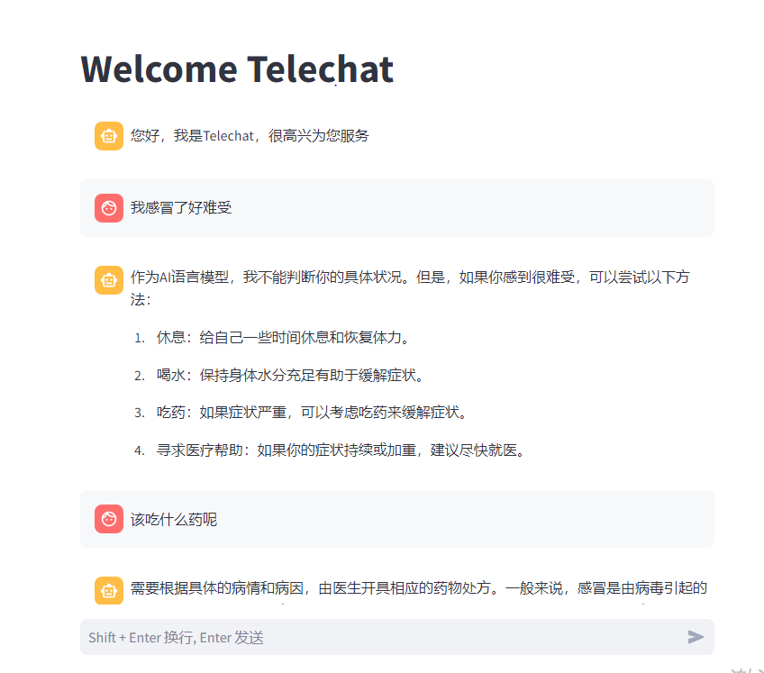

# 快速开始

本教程旨在帮助使用者快速进行Telechat模型的部署开发，主要包括：

- 资源获取
    - 镜像下载
    - 模型下载

- 环境安装
    - 镜像开发

- 推理使用
    - 直接推理

- 模型微调
    - LoRA微调
    - 全参数微调
    - 推理测试

- 模型量化
    - GPTQ量化
    - 量化推理

- 服务化
    - API
    - WEB

## 资源获取


### 镜像下载

**TODO**

### 模型权重下载

**TODO**

## 环境配置


### 镜像开发

暂未整理，敬请期待

## 模型推理

进入Telechat/inference_telechat

```shell
python3 telechat_infer_demo.py
```


## 模型微调

模型微调分为全参数微调和lora微调两种方式：

### LoRA微调

**进入`deepspeed-telechat/sft`路径**， 按照下述命令运行，启动基于DeepSpeed LoRA微调。

```shell
bash run_telechat_lora.sh
```

### 全参数微调

**进入`deepspeed-telechat/sft`路径**，按照下述命令运行，启动基于DeepSpeed的全参数微调。

单节点运行脚本

```shell
bash run_telechat_single_node.sh
```

### 微调后推理测试

**进入`inference_telechat/`路径**，修改telechat_infer_demo.py中PATH为上一步保存的模型路径文件，
这里以telechat-lora-test为例，确保里面存在modeling_telechat.py,configuration_telechat.py,generation_utils.py以及generation_config.json文件。如缺失，可去models/7B/下copy。 copy命令如下：

```shell
cp ../models/7B/{*.py,*.json} ../deepspeed-telechat/sft/telechat-lora-test/
```

随后，按照下述命令运行，进行模型的推理

```shell
python telechat_infer_demo.py
```

## 模型量化

### GPTQ量化

进入Telechat/quant

```shell
python quant.py
```


### 量化推理

调用推理

```shell
python telechat_quantized_infer_demo.py
```


## 服务化

提供了两种简单的**单并发场景**服务化方式，支持流式返回

### API

进入service 文件夹

```shell
python telechat_service.py
```


默认在0.0.0.0:8070会启动telechat服务,可以使用test_json.py,test_stream.py进行测试

其它机器访问服务，需要修改0.0.0.0为服务机器IP。
### WEB

在完成API部署后，运行

```shell
streamlit run webdemo.py
```


默认在0.0.0.0:8501

其它机器访问服务，需要修改0.0.0.0为服务机器IP。